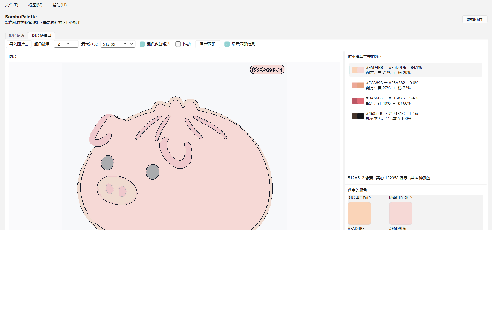

# BambuPalette · 混色耗材色彩管理器

一款独立的 Windows 桌面程序，用来管理自己的打印耗材颜色，并算出**任意两种耗材按 10%–90% 的 81 种比例混出来的颜色**——让你在 Bambu Studio 的「添加混色耗材」里一次就配对成功。

程序不联网、不依赖网页，所有数据都存在本机。

---

## 一、它能做什么

### 混色配方（第一页）

1. **录入耗材**：点「添加耗材」，填名称、品牌、耗材种类、颜色（RGB）、备注。
2. **自动算出全部混色**：录入 N 种耗材，程序立刻列出所有两两组合 `C(N,2) × 81` 个混色。
   - 3 种耗材 → 3 对 × 81 = **243** 个混色
   - 4 种耗材 → 6 对 × 81 = **486** 个混色
   - 5 种耗材 → 10 对 × 81 = **810** 个混色
   - 每对的 81 个比例就是 Bambu Studio 允许的 10%、11% … 90%。
3. **点开任何一个混色**，右侧立刻告诉你：
   - 它由**哪两种耗材**混成（耗材丝1 / 耗材丝2，带颜色和名称）；
   - **比例是多少**（例如 `27% + 73%`）；
   - 预测出来的颜色值（hex / RGB）；
   - 下面还有一行「**在 Bambu Studio 里这样复现**」，把该选哪两种耗材、比例拖到多少、效果预览应该显示什么颜色都写清楚了，照做即可。
   - 「复制配方」按钮把这一段配方文字复制到剪贴板。
4. **双向定位**：
   - 中间色块按 RGB 排列；点任意一个色块，右侧显示配方。被选中的那个色块会用**它自己的颜色**（降低透明度）框起来，其余色块保持原样、不会被压暗——这样你能一眼看出它和周围混色的关系。
   - 点一下色块之间的**空白处**（或按 Esc）就取消选择。
   - 双击一个混色 → 只看这一对耗材的 81 个比例。
   - 想反查？在「目标颜色」里选一个你想要的色，点「找最接近的混色」，程序用 CIEDE2000 色差在全库里找最接近的那一个。
5. **排序与搜索**：可按 RGB、按明度、按色相、按耗材对、按名称排列；搜索框里输入 `3D7B` 这样的 RGB 片段，或耗材名称 / 品牌 / 种类，都能筛。
6. **「全部颜色」勾选框**（「全部混色」标题栏右上角）：勾上之后，耗材丝**本身的颜色**也会作为一个可选项加入网格（点开时写着「耗材本色」，不是混色）。
   - 2 种耗材 → 81 个混色 + 2 个本色 = **83 个颜色**
   - 3 种耗材 → 243 + 3 = **246 个颜色**
   - 本色项**跟着「排序」下拉框排在同一条队列里**，不会被顶到最前面。按 RGB 时它就是按 RGB 插在中间（例如 `#17181C` 排在最暗的位置），按明度 / 色相 / 名称也一样；只有「按母材组合」会让它们聚在最前面，因为它们本来就不属于任何一对母材。
7. **删除耗材**：选中后按 **Del**（或 Backspace）直接删除，点「删除」按钮也是**立刻删掉、不再弹确认框**。删错了重新加一个即可。
8. **添加耗材不预填颜色**：新耗材的颜色框是空的（虚线框、「未选择」），「确认」按钮在你真正选了颜色之前是灰的——所以库里不会出现一个你没填过、却带着白色的耗材。

### 图片转模型（第二页）



把一张图片变成可以打印的**平面多色底板**：

1. 「导入图片…」选择图片。
2. 程序在你的**耗材库 + 全部混色库**里为图片的每一种颜色找最接近的颜色。
3. 左侧是图片，右侧「这个模型需要的颜色」清单：
   - **点右侧某个颜色** → 图片上该颜色的区域高亮，其余变淡；
   - **点图片上某块区域** → 右侧清单自动跳到对应的颜色，并且**把这一行置顶**（其余颜色的顺序保持原样不变）。
4. **「选中的颜色」面板**把这一种颜色讲透：
   - 「**图片里的颜色**」是图上这块区域**自己的平均 RGB**，「**匹配到的颜色**」是耗材/混色库里真正能打出来的颜色——两个色块并排显示，下面各自的 hex、RGB、像素数和占比一目了然；
   - 显示两者的 **CIEDE2000 色差 ΔE00**，并给出「很接近 / 接近 / 偏差较大」的判断；
   - 「匹配到的颜色」下面写着它的**配方**（哪两种耗材、各多少百分比），单色耗材则标明「耗材本色」；
   - 觉得不合适？点「**更换颜色…**」从「全部颜色」里手动挑一个（下面第 6 条）；
   - 换错了点「**恢复自动匹配**」就能撤销，回到程序自动算出来的那一个。
5. 设置「打印宽度 / 底板厚度 / 颜色层厚度 / 底板颜色」，点「生成 3MF（Bambu Studio）」或「生成 OBJ + MTL」。保存对话框默认的文件名是**原图片名 + 当前时间**（例如 `猪包-20261008-143012.3mf`），不会互相覆盖。
6. **「更换颜色…」对话框**列出「全部颜色」——耗材本色 + 全部混色：
   - 默认按「**按跟图片目标颜色最相似**」排序，最像的排在最上面（列表里每一项都直接写着 ΔE00）；
   - 排序下拉框和第一页「混色配方」用的是同一套选项（RGB / 明度 / 色相 / 耗材对 / 名称），外加上面这个「按相似度」；
   - 顶部还有一个搜索框，可以按 hex、耗材名称 / 品牌 / 种类过滤。
7. 生成的模型是**一整块**跟着图片轮廓走的平面底板，上面按颜色涂不同的颜色（不是切成好几块）：
   - 3MF 里颜色直接写进模型本身（`<basematerials>` + 每个三角面的 Bambu `paint_color`），Bambu Studio 打开就是匹配到的那些颜色，不会再被 AMS 里随便哪个耗材的颜色顶掉；
   - OBJ + MTL 是给别的软件用的（Blender、ZBrush、切片软件等）。

### 界面风格（参考 Lumina Studio）

整套配色、圆角和字号沿用 **Lumina Studio 创意工坊**的设计语言（同一套 `--lumina-*` 公共主题变量，模块里读不到宿主时用的就是它自带的兜底值）：

| 用途 | 取值 |
| --- | --- |
| 页面底色 / 卡片 | `#F5F5F7` / `#FFFFFF` |
| 描边 | `#D2D2D7` |
| 正文 / 次要文字 | `#1D1D1F` / `#6E6E73` |
| 强调色（主按钮、选中的标签页） | `#0071E3` |
| 圆角 | 卡片 10px、按钮 7px、输入框 6px |

布局也照着来：顶部一条白色栏（左边品牌名 + 次要说明，右边主操作按钮，底下一条分隔线），下面左侧固定宽度的「我的耗材」卡片栏，右侧是浅灰底的内容区。所有颜色都在 `app/ui/theme.py` 里，改一处全局生效。

---

## 二、混色是怎么算的

程序内置**三个**混色预测引擎，可以在第一页左上角切换：

| 引擎 | 说明 |
| --- | --- |
| **Bambu 混色预览**（默认） | 完全按 Bambu Studio **2.8**（02.08.x）的对话框算法复刻：调用 Bambu 内置的 `filament_mixer` 颜料混色多项式（近似 Mixbox 的四次回归）。**你在现在这版 Bambu Studio「效果预览」里看到的颜色就是这个**，所以拿它来配对最准。 |
| **Bambu 2.5 旧版预览（sRGB 平均）** | 2.5.x 及更早版本的算法：对两个 8 位 sRGB 通道做加权平均。如果你的 Studio 还停在旧版，选这一项才对得上。 |
| **光谱 KM 模型** | 把 sRGB 反推成 31 段可见光反射率（ICC 多项式估计），转成 Kubelka-Munk 的 K/S，混合后再转回 Lab/sRGB。物理上更接近真实颜料混合，颜色比另外两个更暗、更「实」，但与 Studio 的预览值对不上。 |

怎么知道默认引擎是对的？用你给的两张截图验证过：纯白 + 纯黑在 90/10 和 10/90 时，
**颜料多项式算出的预览色与截图里的色块逐字节相同**（`#CBE4EE` / `#041D2E`），
而旧版 sRGB 平均在这两处分别差 27 和 21 个色阶。细节见 [`docs/算法说明.md`](docs/算法说明.md) §1.3。

**你的选择会被记住**（存在 `%LOCALAPPDATA%\BambuPalette\settings.json`，便携模式下在 exe 旁边），
下次打开还是你选的那个，不用每次重设。旧版本存过的选择会自动升级到新默认值，
除非你在新版里明确选了别的。

详细的算法出处、公式和溯源见 [`docs/算法说明.md`](docs/算法说明.md)，第三方代码与数据的授权见 [`NOTICE.md`](NOTICE.md)。

---

## 三、直接运行 exe

```
dist\BambuPalette\BambuPalette.exe
```

双击即可，不需要装 Python。想确认这台机器上跑得起来，可以在命令行里执行一次自检：

```powershell
.\dist\BambuPalette\BambuPalette.exe --selftest
```

它会在当前目录写出 `selftest-report.txt` 和一张界面截图 `selftest-ui.png`，逐项检查
混色引擎（默认引擎是哪一个、颜料多项式的上游样例能不能复现、旧版 sRGB 引擎是否仍然精确）、
图片匹配、建模和 3MF/OBJ 导出是否正常，最后打印 `SELFTEST OK`。全部 20 项都通过才算正常。

**数据存在哪里**

- 默认：`%LOCALAPPDATA%\BambuPalette\filament-library.json`
- 便携模式：在 exe 同目录放一个空的 `portable.txt`，数据就存在 exe 旁边的 `data\` 文件夹里（放 U 盘里带走很方便）。
- 导出的 3MF / OBJ 默认保存到 `%LOCALAPPDATA%\BambuPalette\exports\`。
- **程序一定放得下数据，也一定打得开。** 首选目录用不了时会依次退到 `%TEMP%\BambuPalette\`、用户主目录下的
  `.bambupalette\`，最后退到 **exe 旁边的 `data\`**，每一步都会把已有档案带过去；只有全部失败才弹出说明窗口。
  触发条件通常是杀毒软件临时锁目录、漫游配置重定向，或者 Windows 把刚删掉的目录留在 "delete pending" 状态。

> **怎么判断"用不了"**：不是看目录在不在，而是**真的建一个探测文件再删掉**。Windows 允许进程"看见"一个它无权
> 写入的目录，而且对已存在的目录调用 `mkdir` 即使没有写权限也会成功——只看存在性会把一个拒绝写入的目录当成
> 好目录。这一点曾经造成真实的 bug：保存档案时用的 `tempfile.mkstemp` 在 Windows 上会把"持续拒绝写入"误判成
> "文件名撞车"，然后按 `TMP_MAX`（2147483647）一直重试，于是**双击打不开程序**——窗口还没显示就卡在
> `MainWindow.__init__` 里的那次保存上，单核跑满。现在保存改成有上限的 `open(..., "x")` 重试，拒绝写入
> 会立刻变成一句可读的错误，不会再空转。
>
> 同理：**已经有档案的目录优先于顺序**。如果程序曾在降到低完整性级别（或目录被锁）时把档案写到了 exe 旁边，
> 之后首选目录恢复可写也不会把那份档案丢下——否则用户会看到耗材"凭空消失"。

> 早期版本叫 **FilamentColorStudio**（界面标题「混色耗材管理器」）。如果你机器上已经存在旧目录
> `%LOCALAPPDATA%\FilamentColorStudio\`，新版第一次启动时会自动把它改名接管过来，耗材档案不会丢。
> 改名被系统拒绝、或者新目录已经存在但是空的（上一次启动中断会留下这种目录），就改成把旧文件复制过来，
> 已经存在的文件一律不覆盖。

---

## 四、从源码运行

```powershell
# Python 3.12 + uv
uv venv .venv --python 3.12
uv pip install --python .venv\Scripts\python.exe -r requirements.txt
.\.venv\Scripts\python.exe -m app
```

跑测试与自检：

```powershell
.\.venv\Scripts\python.exe -m unittest discover -s tests   # 单元测试
.\.venv\Scripts\python.exe tools\smoke_app.py              # 端到端自检
.\.venv\Scripts\python.exe tools\screenshot_ui.py          # 生成 samples\ 里的界面截图
```

打 exe：

```powershell
uv pip install --python .venv\Scripts\python.exe pyinstaller
.\.venv\Scripts\python.exe -m PyInstaller --noconfirm --clean build\BambuPalette.spec
```

---

## 五、目录结构

```
app/
  core/       耗材库、混色目录、引擎注册、路径、图片匹配
  spectral/   颜色科学：ICC 多项式、Kubelka-Munk、Lab/ΔE2000
  mesh/       底板建模（平面多色）、3MF 写出、OBJ/MTL 写出
  ui/         Qt 界面：主窗口、色块网格、配方详情、图片页、色卡控件
tests/        单元测试（引擎 / 颜色 / 图片匹配 / 网格 / 导出）
tools/        自检、截图、样张导出、以及复刻算法时用的分析脚本
docs/         中文说明
samples/      示例图片、界面截图、示例模型
```

---

## 六、已知限制

- **3MF 已经在真实的 Bambu Studio 里验证过了**（见下节），但只验证了「能被正确读入、几何与挤出机号完整保留」；实际切片打印效果还需要你自己试一次。
- 混色只在**同一种耗材种类**之间成立（Bambu Studio 本身也是如此，种类不同不允许混色）。程序不会阻止你给不同种类的耗材算混色，但去 Bambu Studio 里会发现混不了。
- 图片匹配是逐像素取最接近的颜色，颜色数量上限 48；照片类图片建议 8–16 色，否则打印出来会非常碎。
- 底板是按像素矩形拼出来的，分辨率很高时三角形会比较多（示例图 150 mm 宽约 9 千个三角形），切片正常，但如果要更精细可以适当调低「最大边长」。

---

## 七、3MF 的正确性是怎么验证的

这台机器上装的是 **Bambu Studio 02.08.02.61**，所以 3MF 不是「照着格式猜的」，而是拿真的 Bambu Studio 跑过一遍往返：

```powershell
.\.venv\Scripts\python.exe tools\verify_bambu_roundtrip.py
.\.venv\Scripts\python.exe tools\verify_bambu_roundtrip.py samples\sample-plate.3mf
```

不带参数时脚本会自己造一块小板；带上 `.3mf` 路径就验证那个现成文件。

它把生成的 3MF 交给 `bambu-studio.exe --export-3mf <输出> <输入>`——Bambu Studio 会读入模型、建场景，再导出一份新的工程文件。然后逐项比对源文件与回读文件的顶点数、三角面数、部件数与每个部件的挤出机号。

实测结果（示例文件 [samples/sample-plate.3mf](samples/sample-plate.3mf)）：

```
source     :   62,589 B  3,076 v  9,164 tri  6 meshes  6 parts
round trip :  100,892 B  3,076 v  9,164 tri  6 meshes  6 parts
    ('1', '1', '底板')                        -> 一致
    ('2', '1', '01_#F2F0EB_大简 PETG HF 白')   -> 一致
    ('3', '2', '02_#C8342E_大简 PETG HF 红')   -> 一致
    ('4', '3', '03_#D9A441_大简 PETG HF 金')   -> 一致
    ('5', '4', '04_#2FA8B8_大简 PETG HF 青')   -> 一致
    ('6', '5', '05_#17181C_大简 PETG HF 黑')   -> 一致
```

> 这一步曾经抓出一个真实缺陷：最早的 3MF 是照抄 Bambu Studio 自己导出工程的布局（每个部件一个 `3D/Objects/object_N.model`，用 3MF production 扩展的 `<component p:path=…>` 跨文件引用）。Bambu Studio 2.8 会**保留元数据却把全部 component 丢掉**，回读出来 `face_count="0"`、几何全空。改成标准 core 3MF（网格全部内联在 `3D/3dmodel.model` 里，component 只按 `objectid` 引用）之后往返完全一致。现在 `tests/test_export.py` 里有专门的回归测试守着这条：不许出现 `3D/Objects/` 条目，且每个 `<component>` 必须能解析到真正带网格的对象。

---

## 八、未来更新方向

按"用户最可能想要"的顺序排列，不是承诺的时间表。每一条都写清楚**现在卡在哪**，方便你判断要不要提。

### 想做、且已经知道怎么做的

1. **三色混色**
   Bambu Studio 的「添加混色耗材」其实支持第三种耗材（内部的三角形取色器，默认 25% / 25% / 50%），
   而本程序目前只算两两组合。加上三色意味着 N 种耗材要算 `C(N,3) × 组合数`，
   5 种耗材就是 10 对 + 10 组三色 ≈ 几万个配色——需要在界面上先想清楚怎么浏览，不是简单加个循环。

2. **把"自己打印出来的真实颜色"录回去校正引擎**
   现在三个模型都是"猜"：颜料多项式是上游回归出来的、sRGB 平均是 Bambu 2.5 的算法、KM 是物理近似。
   但真实打印还受层高、底材、温度、耗材批次影响。计划加一栏"实测颜色"：你打完一块色卡，
   把实际看到的颜色填进对应的混色配方里，程序用这些点对当前引擎做一次局部校正，
   并明确标出"这个配方是实测过的"。这会把工具从"预测"变成"越用越准"。

3. **便携模式 + 多份耗材档案**
   现在便携模式是"exe 旁边有 `portable.txt` 就整个程序便携"。想做的是可以同时存在多份档案
   （例如"工作室 / 家里"两套耗材），在界面上切换，而不是靠改环境变量。

4. **深色主题**
   界面的调色板已经是集中定义的（`app/ui/theme.py`），补齐深色版并不难，只是需要逐个控件过一遍对比度。

### 想做、但还没想清楚怎么做的

5. **图片转模型：轮廓矢量化**
   现在是把像素矩形直接拼成台阶，分辨率高时三角形会偏多。更理想的是把颜色区域抽成轮廓多边形再挤出，
   模型会干净很多。难点是"颜色区域"在照片类图片里非常碎，需要先做一次形态学合并，
   否则抽出来的多边形比现在更糟。

6. **图片转模型：浮雕 / 高度图（可选）**
   当前导出的是**平面**底板（这是明确的产品决定）。如果加浮雕，会作为一个独立选项，
   不影响平面导出。需要同时解决"高度图如何映射到层数"和"Bambu Studio 里怎么表达"两个问题。

7. **直接和 Bambu Studio 联动**
   现在只能在界面上告诉你去 Studio 里怎么填。理论上可以生成一段可以直接导入的 Studio 配置
   （预设 / 耗材映射），但 Studio 的配置格式随版本变化且没有稳定文档，需要先确认长期可行性。

### 明确不打算做的

- **不做网页版。** 程序是独立桌面应用，不联网、数据全在本机。
- **不做云同步、不做账号。**
- **不自动切片。** 切片交给 Bambu Studio，本程序只负责"配色"和"生成可切的模型"。

---

## 九、许可

本项目代码采用 **GPL-3.0-or-later**，全文见 [`LICENSE`](LICENSE)。使用的第三方组件、算法出处与授权说明见 [`NOTICE.md`](NOTICE.md)。
